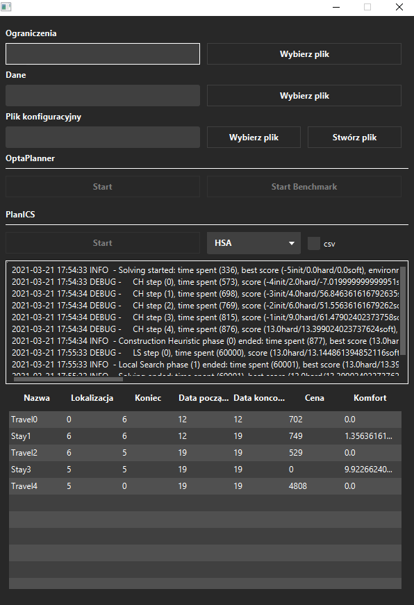

# OptaPlanner-Journey
> The application was created as part of the thesis entitled "Comparison of the efficiency of PlanICS and OptaPlanner planning engines on the example of the travel planning problem". The application uses the [PlanICS](https://kus.ii.uph.edu.pl/) and [OptaPlanner](https://www.optaplanner.org/) planning engines.
The application tries to find the best offers that will meet all requirements. It allows you to select and configure algorithms and generate csv files with exact times.

## Table of contents
* [Screenshots](#screenshots)
* [Technologies](#technologies)
* [Setup](#setup)
* [Features](#features)

## Screenshots




## Technologies
* Spring-expression - 5.2.8
* JavaFX
* Maven
* OptaPlanner - 7.7.0.Final
* OptaPlanner-benchmark - 7.41.0.Final

## Setup
To run this project you need to install [z3](https://github.com/Z3Prover/z3/releases) and add the path to the [Environment Variables](https://support.microsoft.com/en-us/topic/how-to-manage-environment-variables-in-windows-xp-5bf6725b-655e-151c-0b55-9a8c9c7f747d).

```
# Clone this repository
git clone https://github.com/GITjest/OptaPlanner-Journey/

# Using your IDE
```
In [\src\main\resources\journey](https://github.com/GITjest/OptaPlanner-Journey/tree/master/src/main/resources/journey) there are sample files for testing the application.


## Features
* Creating a configuration
* Modification of configuration
* Introducing constraints
* Data input
* Entering the OptaPlanner configuration
* Generating a csv file
